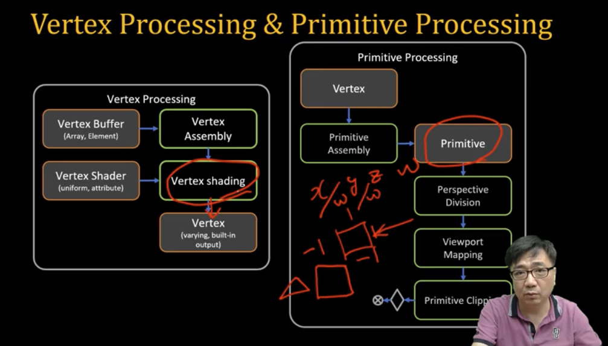

# Primitive Assembly 

[WebGL1.0 Tutorial 04 - Primitive Assembly][https://www.youtube.com/watch?v=tDalT3a-1rI] 아주대학교 이환용 교수님 강의 참고하였습니다.



Veretx Processing 

1. Vertex Buffer  
2. Vertex Assembly 
3. Vertex Shading
4. Vertex 

Primitive Processing 

1. Vertex
2. Primitive Assembly
3. Primitive (x,y,z,w 를 w로 모두 나누는 작업)
4. Perspective Division (w로 나눴을 떄 -1 ~ 1까지 x,y 좌표가 normalize 된 좌표) 
5. Viewport Mapping (코드에서 GLViewport canvas에 어디 부분에다만 그릴 것이다. -> 좌표가 screen 좌표로 나옵니다. )
6. Primitive Clipping (viewport 에 그릴 필요가 없는 것들은 다 잘라버림.)


`Primitive Assembly 어떻게 결정 하느냐? 어떤 방법으로 하는 지 결정하느냐?`

drawArrays and drawElements

- POINTS 
- LINES, LINE_STRIP, LINE_LOOP 
- TRIANGLES, TRIANGLE_STRIP, TRIANGLE_FAN


pipeline diagram 이미지

Ratseriation 

Primitive 데이터 (점 선 삼각형)이 오게 됩니다. 
Buffer에 draw vertex array, vertex element 드로잉 하는 방법을 했습니다.

드로잉 방법에는 - drawArray(POINTS, LINES, LINE_STRIP, LINE_LOOP, TRIANGLES, TRIANGLE_STRIP, TRIANGLE_FAN) 와 drawElements 가 있습니다.

``` javascript
void drawArrays(enum mode, int first, long count) 
mode : POINTS, LINES, LINE_STRIP, LINE_LOOP, TRIANGLES, TRIANGLE_STRIP, TRIANGLE_FAN,

void drawElements(enum mode, long count, enum type, long offset)
mode : POINTS, LINE_STRIP, LINE_LOOP, LINES, TRIANGLE_STRIP, TRIANGLE_FAN, TRIANGLES 
type : UNSIGNED_BYTE, UNSIGNED_STORT(0 ~ 65535 그 이상은 한 번에 그릴 수 없습니다.)
```

POINTS 는 점.

gl_PointSize - point radius 
gl_PointCoord - fragment shader ...()


LINE 

GL_LINES 
- n vertices - n/2 lines 
- (V0, V1), (V2, V3), (V4, V5) (라인) 

GL_LINE_STRIP 
- n vertices - (n-1) lines 
- (V0, V1), (V1, V2), (V2, V3)... (라인이 계속 이어져 있는 것 (끝점에서는 이어지지 않음))

GL_LINE_LOOP
- n vertices - (n) lines 
- (V0, V1), (V1,V2),(V2,V3),(V3,V4) (시작점으로 돌아가는 것까지 이어 집니다.)

lineWidth - set line width 


Triangle 

GL_TRIANGLES 
- n vertices - n/3 triangles 
- (V0,V1,V2),(V3,V4,V5)

GL_TRIANGLE_STRIP
- n vertices - (n-2) triangles
- (V0,V1,V2),(V2,V1,V3)...

GL_TRIANGLE_FAN
- n vertices - (n-2) triangles 
- (V0,V1,V2),(V0,V2,V3),(V0,V3,V4) 

실습에서는 - POINT, Line, Triangle 테스트 