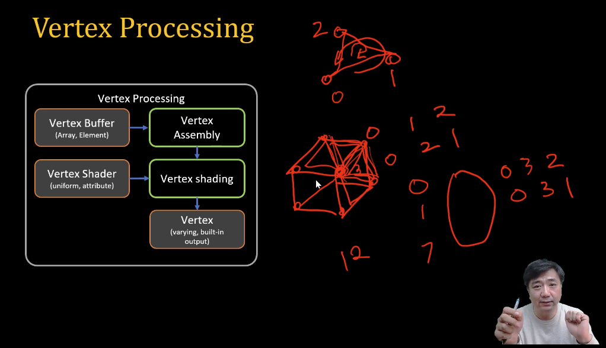

# 02. Buffer, View, Buffer Object 

[WebGL1.0 Tutorial 02 - Hello Triangle ][https://www.youtube.com/watch?v=RUxDkgk8uvA] 아주대학교 이환용 교수님 강의 참고하였습니다.

`Vertex Buffer 어떻게 만드느냐가 이 발표의 목적.`
Vertex Processing 에서 어떤 일이 일어나는 지 이해해야 합니다.



Vertex 는 꼭짓점

1. Vertex Buffer(array, element)
2. Vertex Assembly(사용중인 Vertex 골라내기) <- (Vertex Shader (uniform, attribute) 입력으로 들어가야 할 속성)
3. Vertex shading
4. Vertex (varying(fragment Shader에서 사용 됨), built-in-output)

삼각형을 그릴 떄 좌표는 같지만, 색상 등 속성이 다를 수 있습니다. -> 이럴 떈 Element 로 만드는 것이 불가능 합니다.
Array로 만드는 것을 권장 합니다.

Vertex Data 를 만들기 위해서는 보내줄 데이터를 자바스크립트에서 만들어 주어야 합니다.
ArrayBuffer Or Typed Arrays 

Buffers - 구조화되지 않은 바이너리 데이터
Views - 실제로 이 데이터를 access 하기 위해서. 
 
``` javascript
const buffer = new ArrayBuffer(8);
const view = new Int32Array(buffer);
```
(Vertex) Buffer Objects (GPU 안에 들어있는 데이터를 저장 -> 렌더링 성능, 메모리 변동 감소, 전력 소비량도 줄어듬.)
    Target GL_ARRAY_BUFFER(0.4, 0.2 .. 이런 식으로 저장), GL_ELEMENT_ARRAY_BUFFER


Buffer Object 

1. Object createBuffer() 
2. void bindBuffer(enum target, Object buffer)
3. void bufferData(enum target, long size, enum usage)  or void bufferData(enum target, Object data, enum usage)
    - target: ARRAY_BUFFER, ELEMENT_ARRAY_BUFFER 
    - usage: STATIC_DRAW(데이터를 변경하지 않고 계속 그릴 것), STREAM_DRAW(그림 한 번만 그리고 변경 x), DYNAMIC_DRAW(데이터가 자주자주 변경됩니다.)
4. void deleteBuffer (버퍼를 계속 사용한다면 삭제할 필요는 없음)
5. getBufferParameter (버프 사이즈 크기 or 어떤 목적으로 사용하느냐?)
    - target: ARRAY_BUFFER, ELEMENT_ARRAY_BUFFER
    - pname: BUFFER_SIZE(크기), BUFFER_USAGE(bufferData usage 어떤 목적으로?)
  


