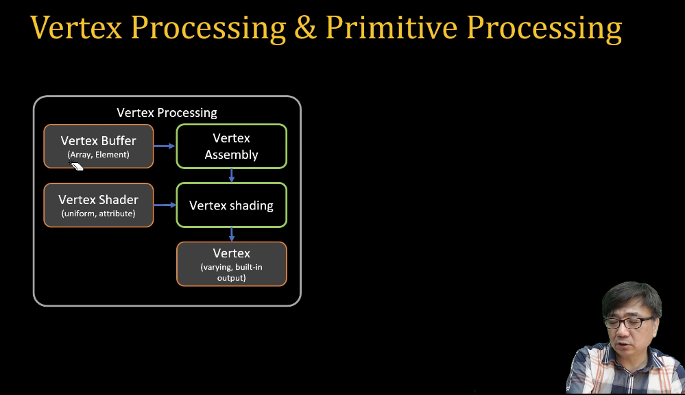
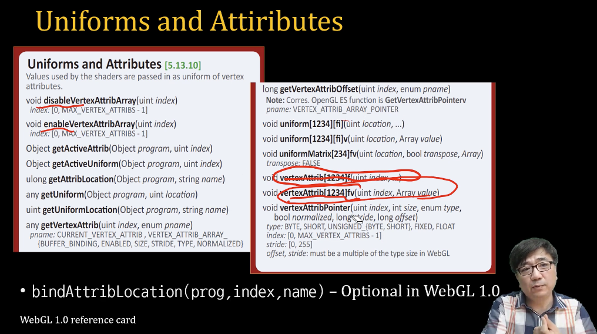

# Attributes and Uniforms 

[WebGL1.0 Tutorial 03 - Uniform and Attributes][https://www.youtube.com/watch?v=-umyZqIxQps] 아주대학교 이환용 교수님 강의 참고하였습니다.




`Vertex, Fragment Shader 에 여러 개의 정보들을 전달 해 주고 싶습니다.`
Vertex Attributes, Uniforms(동일 정보 주고 싶을 떄)

`Vertex Shader (uniform, attribute) -> Vertex Shading -> Vertex` 


`Uniforms` 
`Samplers(Option) 텍스트. (지원하는 버전이 있고 지원하지 않는 버전이 있음)`

Vertex 가 600개가 들어오면 100개씩 병렬 처리 됩니다. (각각의 process 가 6개가 있는 데, 각각의 process 가 각각 다른 vertex 를 가지고 있습니다.)
병렬 처리이기 떄문에, 이 부분을 확실히 이해해야 합니다.

Vertex 마다 출력을 Varying 이라는 output (8개 까지 가능)

미리 정해진 output

gl_Position
gl_FrontFacing
gl_PointSize


## Vertex Attributes 



Get Max attributes 
    (gl.) MAX_VERTEX_ATTRIBS must be >= 8

Setting Constant Vertex Attribute - same for all vertex 
    gl.VertexAttrib{1234}f(GLuint index, Float x, ...); // z 값을 주고 싶다면? 3이 들어가는 명령어. 
    gl.VertexAttrib{1234}fv(GLuint index, Array value); // 벡터로 주고 싶을 떄 사용. v 가 들어가 있으면 array
    must disable VertexAttribArray! 

``` javascript
void disableVertexAttribArray(uint index )
    // index: [0, MAX_VERTEX_ATTRIBS - 1]
void enableVertexAttribArray(uint index)
    // index: [0, MAX_VERTEX_ATTRIBS - 1]
```


Settings Attribute location in shader 
    - void bindAttribLocation(Object program, uint index, string name)
  
Getting Attribute location in shader
    - ulong getAttribLocation (Object program, string name)
  
Setting Vertex Arrays in VBO 
    // size 는 뭐나면? 몇 개 컴포넌트로 구성되어 있냐? x,y,z 가 들어있으면 3.
    // type 은 중 하나.
    // index 는 0부터 7까지고, stride 는 다음 vertex 까지 갈려면 몇 개를 점프해야 하느냐? 
    void vertexAttribPointer(uint index, int size, enum type, bool normalized, long stride, long offset) 
        type: BYTE, SHORT, UNSIGNED_{BYTE, SHORT}, FLOAT (HALF_FLOAT in WebGL2)
        index: [0, MAX_VERTEX_ATTRIBS - 1], stride: [0, 255]
        normalized: True/False (e.g. BYTE - (Value+0.5)/127.5)


Vertex 만드는 방법은 2가지가 있습니다.


Example Attributes - 위치, 좌표 정보.
    `Position x 3, Color x 4, ST x 2, UV x 2`

1. Array of structure
    전부 쭉 Vertex 를 쭉 사용합니다. -> 이런 것들을 Strcture 라고 부릅니다.
    이 방법이 코드가 훨씬 짧습니다.
    1번 방법이 2번 방법보다 훨씬 많이 쓰입니다. 

    ``` javascript
    A = [x1, y1, z1, r1, g1, b1, a1, t1, ...];
    ```

2. Structure of Array
    좌표는 A에, 색상은 B에 따로따로 넣고, Buffer를 여러 번 보내 작업 할 수 있습니다.

    ``` javascript
    A = [x1, y1, z1, x2, y3, z2, ...]
    B = [r1, g1, b1, a1, r2, g2, b2, a2, ...]
    ```

