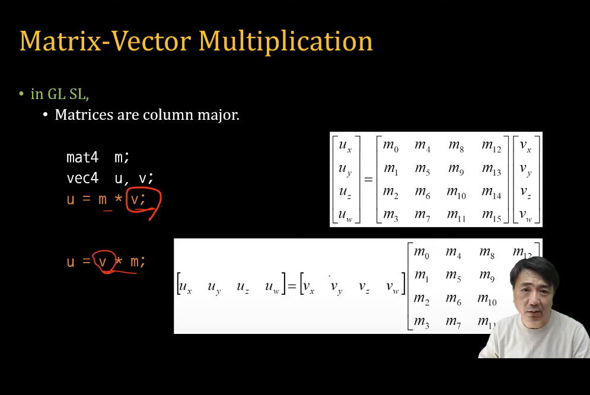

# Shading Language 


[WebGL1.0 Tutorial 05 - Shading Language][https://www.youtube.com/watch?v=Bsdpo6EIWKo] 아주대학교 이환용 교수님 강의 참고하였습니다.

OpenGL 2004 년 부터 시작 -> 계속 업데이트 중.
OpenGL ES OpenGL 일부 기능 축소 임베디드 시스템. 

Shading 프로그래밍 배우기 위해서는. 
`Shading 은 병렬 처리를 위한 언어입니다.`

- C/C++ 비슷한 언어.
- Parallel Programming (SIMD) (똑같은 작업인데 데이터만 다른 병렬 처리 기법) 
- Processor 

    Vertex Processor 
    
    - 하나의 vertex 를 하나씩 처리. 
    - vertex 여러 개를 가진 계산을 할 수 없습니다. 

    Fragment Processor 

    - 궁극적으로 기본저긍로 fragment 하나 하나 단위로 update 되어서 결국 frame-buffer 에 저장.


## WebGL API 

``` javascript
void attackShader(Object program, Object shader) // program vertex, fragment shader 를 넣을 떄 attack 
void bindAttribLocation(Object program, uint index, string name) // 데이터를 쓰기 위해서 준비 시키는 단계. 
void compileShader(Object shader) // 컴파일 
Object createProgram() // 생성 
Object createShader(enum type)  
    type : VERTEX_SHADER, FRAGMENT_SHADER
void deleteProgram(Object program)
void deleteShader(Object shader)
void detachShader(Object program, Object shader)
any getProgramParameter(Object program, enum pname) // Program compile 하고 어떤 상태인지, Shader 가 attack 되있는 지.
    pname: DELETE_STATUS, LINK_STATUS, VALIDATE_STATUS, ATTACHED_SHADERS, ACTIVE_{ATTRIBUTES, UNIFORMS}
string getProgramInfoLog(Object program) // Log file 에 대한 정보를 볼 수 있습니다. 
any getShaderParameter(Object shader, enum pname)  // Shader 를 get 할 수 있습니다. 
    pname: SHADER_TYPE, DELETE_STATUS, COMPILE_STATUS 
string getShaderInfoLog(Object shader) // Log 가져오기.
string getShaderSource(Object shader) // Source 가져오기. 
bool isProgram(Object program) // Program 입니까 ? true false 
bool isShader(Object shader) // Shader 입니까 ? true false 
void linkProgram(Object program) 
void shaderSource(Object shader, string source) // Source 정의 할 떄 
void useProgram(Object program) // 프로그램 여러 개 있을 떄 이 프로그램 쓸 것이라고 정의. 
void validateProgram(Object program) // 프로그램이 정상적으로 validate 인지 아닌 지 체크 할 수 있습니다.
```


## Shading Language Basic - WebGL API 

Shader 만드는 순서.

Source Code made with Strings (vertexShaderSource)

``` javascript
gl.vertexShader = gl.createShader(gl.VERTEX_SHADER);
gl.shaderSource(gl.vertexShader, vertexShaderSource); // veretxShader 를 ShaderSource 집어 넣어줍니다. 
gl.flagShader = gl.createShader(gl.FRAGMENT_SHADER);
gl.shaderSource(gl.fragShader, fragmentShaderSource); // ...
```

Compile shader code 

``` javascript
// Shader 컴파일 
gl.compileShader(gl.vertexShader);
gl.compileShader(gl.fragShader); 
```

Program - Create / Attack / Link / Use 

``` javascript
gl.programObject = gl.createProgram(); $
gl.attackShader(gl.programObject, gl.fragShader); // attack 
gl.attackShader(gl.programObject, gl.vertexShader); // attack 
gl.linkProgram(gl.programObject); // 둘을 link -> 2개의 프로그램이 연결됩니다.
gl.useProgram(gl.programObject);
```


GLES SL 1.00 Programming 

#extension -> 확장 모듈을 선택해서 사용할 수 있습니다.
#version -> webgl version


Language Reserved Keyword 


sampler2D samplerCube -> WebGL 1.0, WebGL 2.0  Text 를 지원 합니다. (Cube Texture)


Basic Data Types 

Basic 

- int
- float
- bool
- void
  
Vectors 

- vec2, vec3, vec4 // floating point
- Also int (ivec) and boolean (bvec) 

Matrices (n x n)

- mat2, mat3, mat4 
- Stored by columns (column major !)
- Standard referencing m[row][column]

Texture 

- sampler2D, samplerCube 

Arrays, Structure

C - like 


Matrix-Vector Multiplication



u = m * v;
u = v * m; 

Vector 를 어디에서 곱하느냐에 따라 Matrix 가 달라집니다.


## Pointers 

- GLSL 에서는 포인터가 없습니다.
포인터하고 유사한 in out in out 이런 식으로 사용하면 함수를 만들 떄 포인터가 있는 것처럼 함수를 만들 수 있습니다.

C struct -> C언어하고 비슷합니다.


## Qualifiers 

한정자. (변수를 한정 짓는 것)

Storage Qualifiers (메모리에 어떻게 저장되는 지)

- const(상수), attribute(vertex 속성을 정할 떄), uniform(vertex, fragment 모두 공통으로 가지는 입력 값), varying(fragment, vertex 사이에 데이터를 주고 받을 떄 사용)
- Vertex Attributes(gl_Position) -> Vertex Position 결정해서 사용, varying values rasterizer 에 의해서 interpolated 가 일어납니다. )

Precision Qualifiers 

- highp(32bit), mediump(16bit), lowp(8bit) (정밀도)

Parameters

- in,out,inout (함수에서 f 를 선언하고 값을 주고 받을 수 있음)

Variance / Invariance (값을 고정하고 사용 할 떄)


Order of qualification (strict order)

- invariant-qualifier storage-qualifier precision-qualifier
- storage-qualifier parameter-qualifier precision-qualifier


Attribute Qualifier 

- Attribute-qualified variables can change at most once per vertex 
- There are a few built in variables such as gl_Position
- can be (float, vec2, vec3, vec4, mat2, mat3, and mat4)


Uniform Qualifier 

- 모든 vertex, fragment 똑같이 constant(공통) 값을 사용하고 싶을 떄 
- 어플리케이션쪽에서 uniform 바꿔서 shader 보내줄 수 있습니다.


Varying Qualifier 

- frag, vertex 주고 받을 떄 사용.
- 자동으로 interpolated 가 됩니다.
- float, vec2, vec3, vec4, mat2, mat3, mat4 를 varying 으로 사용할 수 있습니다. 


Parameter Qualifiers : Passing values in Shader function

- call by value-return
- Variables are copied in
- Returned values are copied back
- Three possibilities 
    In (default) 
    out 
    inout 


``` c++
vec4 diffuse(inout float myFloat, vec3 light, in vec3 normal, out vec3 specular) {
    specular = ...
    return dot(normal, light);
}
```


Precision Qualifiers / Precision (항상 씀)

highp, mediump, lowp 

- highp - for vertex shader
- lowp - for color value 
- mediump - somewhere in (lowp <= precision <= highp)
- Example 
  - lowp float color;
  - varying mediump vecd2 Coord;
  - lowp ivec2 foo(lowp mat3);
  - highp mat4 m; 

Default Precision
    Example
        - precision highp int;
        - precision lowp sampler2D 


Constructors 


Conversion and Scalar 

int(bool), int(float), float(bool), float(int), bool(float), bool(int) // 0 or 0.0 are converted to false

Vector

vec3(float), vec4(ivec4), vec2(float, float), ivec3(int, int, int), bvec4(int, int, float, float), vec2(vec3), vec3(vec2, float), vec3(float, vec2)

Matrix

mat3(float) // Diagonal=float, others=0
mat2(float, float, float, float), mat3(vec3, vec3, vec3, vec3)

Struct

Similar to C 


Components 


Vector 

- Component 
    - [0] [1] [2], [3] {x,y,z,w} {r,g,b,a} {s,t,p,q}

- Swizzle 

    - vec4 pos = vec4(1.0, 2.0, 3.0, 4.0);
    - vec4 swiz = pos.wzyx; // swiz = (4.0, 3.0, 2.0, 1.0)
    - vec4 dup = pos.xxyy; // dup = (1.0, 1.0, 2.0, 2.0)
    - Version 1.00

Matrix
    Component
    // Component 를 바꾸고 싶을 떄는 이차원 행렬로 바꾸면 됩니다.
    - mat4 m;
    - m[1] = vec4(2.0); // sets the second column to all 2.0
    - m[0][0] = 1.0; // sets the upper left element to 1.0
    - m[2][3] = 2.0; // sets the 4th element of the third column to 


Vector and Matrix Operations 


Scalar operation

- for each componnet: V2 = V1 * 2.0 


Vector operation

- component by component : V3 = V1 + V2 


Matrix * Vector 

- u = v * m // is same as 
    u.x = dot(v, m[0]); // m[0] is the left column of m
    u.y = dot(v, m[1]); // dot(a,b) is the inner (dot) product of a and b
    u.z = dot(v, m[2]); 


Precision of operation 

- Implementation dependent 


Statement and Structure

- Program blocks 
    - statement, declaration, function]
  
    - if-else / for / while / do-while / discard / return / break / continue 
        - discard - only for fragment shader 


Built-in Variables 


Vertex Shader

- gl_Position - homegeneous vertex position
- gl_PointSize - size of point(pixel unit)
- global scope 


Fragment Shader

- gl_FragColor - Color of fragment vertex 
- gl_FragData - Array
- Cannot use both 


gl_FragCoord - x,y,z 1/w (Read Only, screen coordinates)
gl_PointCoord - 2D coord of current fragment is located 
gl_FrontFacing - true/false if front-facing primitives 


Built-in Attributes 

- Vertex shader 

    - Build-in Constant(value is minimum requirement)
    
    gl_MaxVertexAttribs = 8; 
    gl_MaxVertexUniformVectors = 128;
    gl_MaxVaryingVectors = 8;
    gl_MaxVertexTextureImageUnits = 0;
    gl_MaxCombinedTextureImageUnits = 8;
    gl_MaxTextureImageUnits = 8;
    gl_MaxFragmentUniformVectors = 16;
    gl_MaxDrawBuffers = 1;

    - Built-in Uniform

``` c++
struct gl_DepthRangeParameters {
    highp float near; // n
    highp float far; // f
    highp float diff; // f - n 
};
uniform gl_DepthRangeParameters gl_DEpthRange;
```