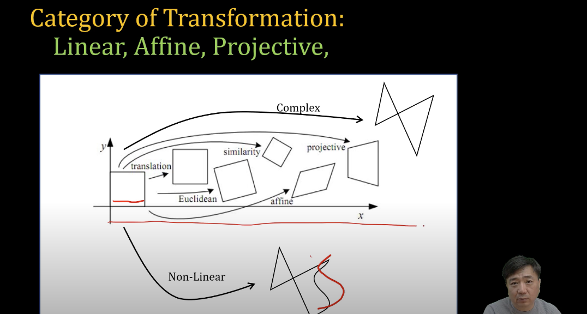
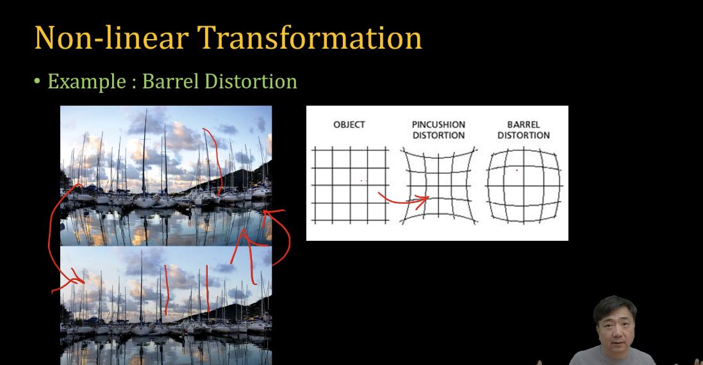
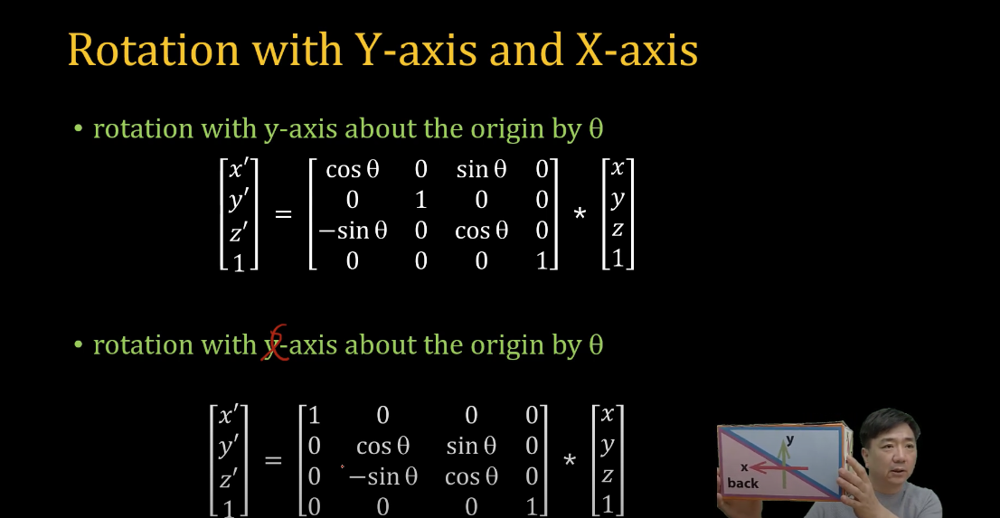
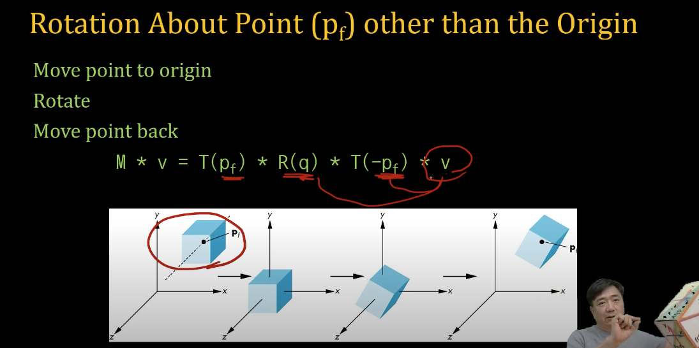

# Transform 

[WebGL1.0 Tutorial 06 - Transform][https://www.youtube.com/watch?v=77cmqAEcvJU] 아주대학교 이환용 교수님 강의 참고하였습니다.

Transformation 정의: 어떤 Geometry 가 있는 데 다른 Geometry 로 맵핑시켜 줍니다. 
-> Transformation을 여러 가지로 정의 할 수 있겠지만 : 모양이 바뀌는 게 어떻게 모양이 바뀌느냐에 따라서, 구분을 할 수 있습니다.

가장 넓은 영역을 : Non-Linear Transformation.

1. Linear
2. Affine 
3. Projective 



Transformation 을 하는 데 직선 유지를 하지 않으면 -> Non-Linear
직선이 유지 되지 않는 케이스를 - Linear Transformation 이라고 할 수 있습니다.

정사각형을 오리지널로 두고, 모양이 지그제그 모양으로 바뀔 수 있으면 -> Complex Transformation 이라고 할 수 있습니다.
두 변이 평행한 두 선분이 평행하지 않을 경우 -> Projective Transformati
두 선분이 평행을 유지한 것 -> affine Transformation 
똑같은 정사각형에서 위치만 바뀜 -> translation 
면적이 바뀔 수 없을 경우 -> euclidean 
면적이 바뀌었을 경우 -> similarity 


주로 Linear Transformations 을 주로 사용합니다.
그 이유는 : 우리가 사용하는 그래픽스 - rotation, translation, scaling, shear (가장 많이 사용) 
뭔가를 다룰 떄 Geometry 정의 할 떄 -> vertex, fragment 를 이용해 만든 뒤 transform 을 했을 떄 vertex attribute 를 가져다가 matrix 를 곱합니다.

만약 Non-Linear 로 fragment 점선이 바뀔 수 있다면 0 -> 1 로 점선이 아닌 점선이 바뀌는 위치 하나하나 마다 맵핑 시켜 줘야 하므로, 단순한 일이 아닙니다. 



PINCUSHION DISTORTION -> 방석같은 것을 잡아 떙기면 줄어들게 생김. 
BARREL DISTORTION -> 뚱뚱하게 만드는 과정 


## 대표적인 Transform


### Translate 

- Moving vertex with amount of [tx, ty, tz]
-> x,y,z 값을 옮기는 것.

``` javascript
x' = x + tx
y' = y + ty 
z' = z + tz 
```

-> tx,ty,tz 수식을 덧셈으로 표현하면 복잡합니다.
호미지어스 코디네이트 단위로 바꿉니다. -> 1를 추가.

``` javascript
translateMat = 
    [1.0, 0.0, 0.0, 0.0,
     0.0, 1.0, 0.0, 0.0, 
     0.0, 0.0, 1.0, 0.0,
     tx, ty, tz, 1.0];
```

행렬을 하나만 만들어 놓고 계속 사용하게 됩니다. 
Shader Program 에서 Matrix 를 여러 개 보내서 처리하는 것 보다 Matrix 하나로 계산해서 쉐이더로 보내는 것이 효율적입니다.


### Scale 

- Expand or contract along each axis (with respect to Origin 0,0)

``` javascript
x' = x * sx
y' = y * sy 
z' = z * sz  

scaleMat =
    [sx, 0.0, 0.0, 0.0, 
     0.0, sy, 0.0, 0.0,
     0.0, 0.0, sz, 0.0,
     0.0, 0.0, 0.0, 1.0];
```


### Rotation with Z-axis 

``` javascript
x' = x코사인 - y사인 
y' = x사인 + y코사인 
z' = z 

rotZmat =
    [Math.cos(th), Math.sin(th), 0.0, 0.0,
    -Math.sin(th), Math.cos(th), 0.0, 0.0,
    0.0, 0.0, 1.0, 0.0,
    0.0, 0.0, 0.0, 1.0];
```

Rotation with Y-axis and X-axis 

역행렬로도 계산 할 수 있습니다.




### Shear with X-axis 

- rotation with z-axis about the origin by degrees

``` javascript
x' = x + y cot 
y' = y  
z' = z 

shearXMat =
    [1.0, 0.0, 0.0, 0.0,
     Math.cot(th), 1.0, 0.0, 0.0,
     0.0, 0.0, 1.0, 0.0,
     0.0, 0.0, 0.0, 1.0];
```


### Inverses Transform 

역행렬이라고 하는 것, 역변환을 갖는 것은 -> 역으로 하는 것과 똑같다.
어떤 Transform 을 했다 Ma * Mb * Mc * v -> 벡터에 가까운 것이 되고, Mc -> Mb -> Ma 


### Rotation About Point (Pf) other than the Origin 

큐브를 원하는 지점을 중심으로 회전을 하고 싶으면? 
-> M * v = T(pf) * R(q) * T(-pf) * v 

거꾸로 생각하기. 
벡터(v) 가 곱해지면 벡터에 가까운 값부터 제일 먼저 작동합니다.

