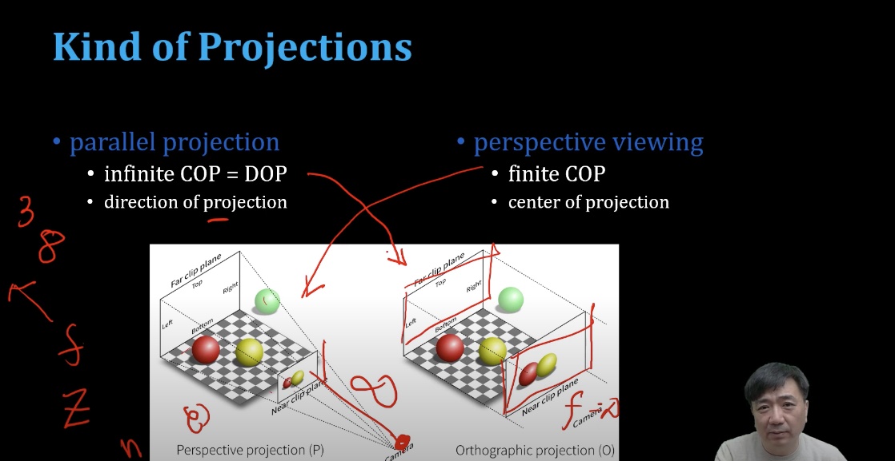
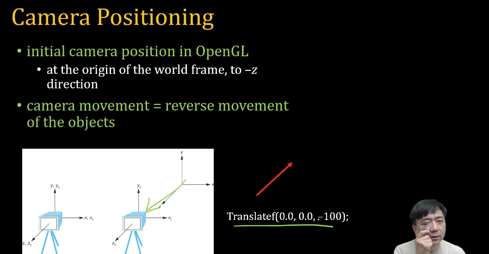

# Projection Transform 

[WebGL1.0 Tutorial 07 - Projection Transform ][https://www.youtube.com/watch?v=hGo0UAebWnk] 아주대학교 이환용 교수님 강의 참고하였습니다.

Primitive Processing 과정을 거친 Primitive 은 삼각형이 만들어 집니다.
해당하는 각각 vertex varying 들이 primitive 로 전달되게 됩니다.

## Coordinate System & Degree of Freedom 

어떤 방향으로 자리를 잡고 있느냐가 자리 잡게 됨. (x,y,z) 
-> 점 하나를 정의하는 데, 정의 위치와 방위 정하는 데는 6개의 변수가 필요합니다. (rotation x, rotation y, rotation z, x, y, z)

## Introducing View Matrix 

model matrix : 모델이 움직이고 키우고 변합니다. -> actors 가 움직이고, actors 가 넘어지고, 회전 등 model matrix 로 갑니다. 
view matrix : 카메라를 움직이는 것은 카메라 위치에서 모델을 거꾸로 움직이는 것 과 같습니다.

## Camera Paramaters 

- 카메라 위치 Camera Position (카메라의 기준점에 x,y,z coordnate)
- 카메라 방향 Camera Direction (카메라 방향 rotation x, rotation y, rotation z)

- Optical Parameters 
    -> Focal Length - Field of View(fov) 
    -> Focus Position
    -> Iris (밝기)
    -> Lens Distortion  

- We will deal with only 
    -> Pin-hole camera 

## Kind of Projections 

- parallel projection 
  
    -> infinite COP = DOP 
    -> direction of projection 

- perspective viewing 

    -> finite COP 
    -> center of projection 

## Camera Positioning 

initial camera position in OpenGL 
-> 카메라 위치 -z 것과 만큼 이동합니다. 

camera movement = reverse movement of the objects 

## Viewing API 

general viewing API 
-> PHIGS, GKS-3D : famous graphics library 

camera setting?
    VRP (view reference point) 
    VPN (view plane normal) 
    VUP (view up vector) 

Look-At Interface 

-> camera position + camera orientation 

-> look-at approach 
    - Define Up Vector or Rotation Angle (Up(x), Up(y), Up(z))

## Look-At Approach 

user input 
    -> in the world frame 

eye position: (eye(x), eye(y), eye(z))
at position: (at(x), at(y), at(z)) 
up vector: (up(x), up(y), up(z)) 

VRP = (eye(x), eye(y), eye(z))
VPN = (at(x), at(y), at(z) - (eye(x), eye(y), eye(z)))
VUP = (up(x), up(y), up(z)의 방향 보정
normalization 

